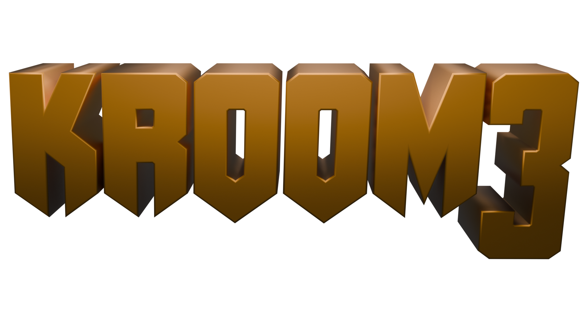

                                      "don't worry, you'll get your product"
                                                                            - Bertruger

Fork of RBDOOM3-BFG v1.3.0 source port aims to modernize DOOM 3 BFG while also trying to mainting the same look of the game but giving more flexibility to modders, successor of D3ModdingKit.

## About the Port

Fork of RBDOOM3-BFG v1.3.0 source port aims to modernize DOOM 3 BFG while also trying to mainting the same look of the game but giving more flexibility to modders, successor of D3ModdingKit.
While this is a D3ModdingKit succesor is not by any means a fully replacement.

# Compiling Instructions

Compiling its straight forward following these steps:
- For Windows 10/11:
	* Clone with Submodules.
	* Install Visual Studio 2022 Community Edition With C++ Workspace.
	* For x64/x86 run **cmake_msvc2022_x86_64** or **cmake_msvc2022_x86** bat files.
- For Windows 7 (Untested):
	* Clone with Submodules.
	* Install Visual Studio 2019/2017
	* [Download and Install DirectX SDK June 2010](https://www.microsoft.com/en-us/download/details.aspx?id=6812)
- For Debian base distros
	* Clone with Submodules.
	* Install the pre-requirements
	```
	sudo apt-get install -y build-essential nasm pkgconf autoconf libtool libx11-dev libxft-dev libxext-dev libwayland-dev libxkbcommon-dev libegl1-mesa-dev libibus-1.0-dev libglfw3-dev libgl1-mesa-dev libglu1-mesa-dev freeglut3-dev mesa-common-dev libxmu-dev libxi-dev libgl-dev libdecor-0-dev libxrandr-dev libxxf86vm-dev libx11-xcb-dev libxcb-dri2-0-dev libxcb-glx0-dev libxcb-icccm4-dev libxcb-keysyms1-dev libxcb-randr0-dev python3-jinja2 libltdl-dev
	```
	* Open a termina in **neo/** folder and run:
	```
	chmod +x cmake_linux.sh
	```
	* In the same terminal run:
	```
	./cmake_linux.sh gcc debug
	```

# ".plan" <a name="plan"></a>

Currently there's not a .plan set in stone there's a lot of things that i want to get going like:

- Re-introduced MFC tools
- Refactor the render apis to be like v1.5.0 RBDOOM3-BFG
- Re-introduce .bmtrs has it was present on the original TEKUUM